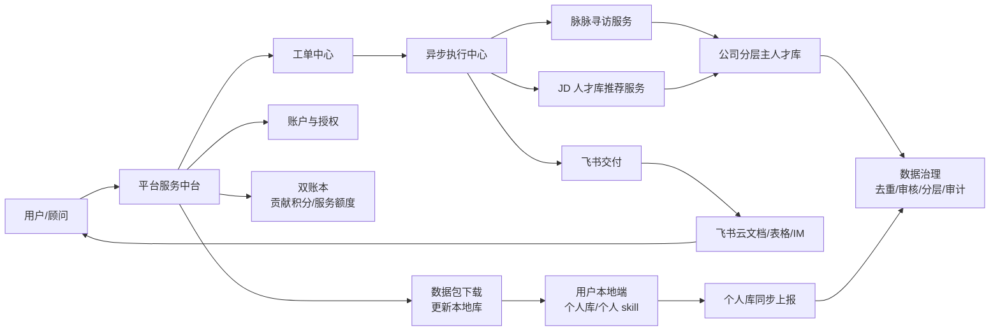
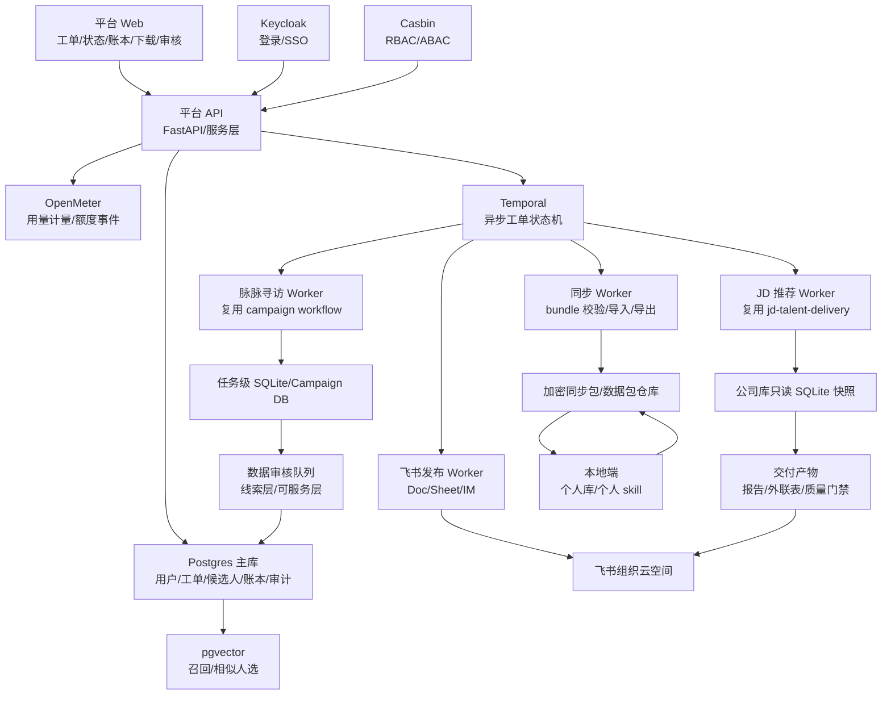
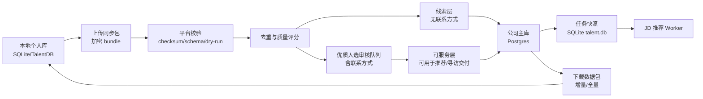
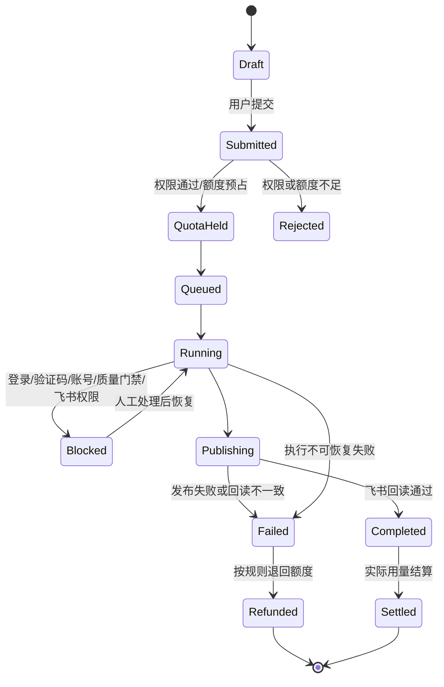
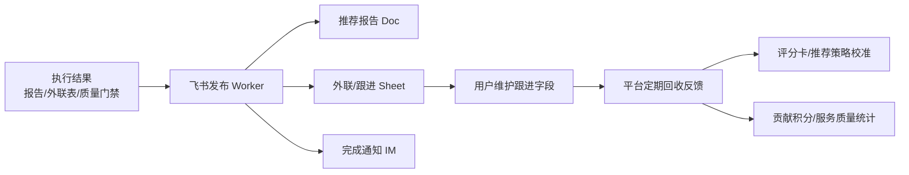
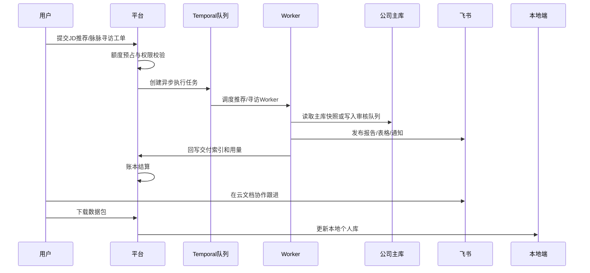

# 平台化人才服务中台产品方案

> 日期：2026-05-29
> 路线：服务中台 + 飞书协作
> 状态：设计方案，暂不进入实施计划

## 1. 背景与目标

当前项目已经具备三类核心能力：

- 脉脉寻访：基于 `maimai-unattended-campaign` 的长任务、断点恢复、Campaign DB、详情抓取和飞书交付能力。
- JD 推荐：基于 `jd-talent-delivery` 的岗位画像、评分卡、人才库只读匹配、TopN 推荐和飞书发布能力。
- 人才库与同步：基于 `TalentDB`、`talent_sync.py`、`talent_cloud_sync.py` 的本地 SQLite 人才库、bundle 校验、冲突处理和数据包同步能力。

本方案目标是把这些能力平台化为公司级开放服务：

1. 用户像 SaaS 一样提交工单，申请执行脉脉寻访和 JD 人才库推荐。
2. 平台异步执行任务，结束后把结果推送到飞书组织云空间。
3. 用户在飞书云文档中协同维护跟进信息。
4. 用户可下载数据包更新本地个人库。
5. 本地端只保留个人数据库管理和个人定制 skill。
6. 个人库能自动向公司主库同步贡献数据。
7. 平台建立账户、积分、服务额度、计费和审计体系，量化寻访、推荐和数据贡献价值。

确认后的首期边界：

- 首期采用混合路线：先做工单、公司库、飞书交付、数据包和积分账本；注册、支付、自动授权后置。
- 用户对象内部可信用户为主，权限和数据模型预留外部合作方接入。
- 主库采用分层治理：无联系方式为线索层，有联系方式且审核通过为可服务层。
- 脉脉授权采用混合授权：首期公司托管账号池 + 人工处理登录/验证码，预留用户自带账号能力。
- 账本采用双账本：贡献积分和服务额度分开，首期人工发放和结算。
- 飞书作为首期业务协作主入口，平台提供工单、只读结果页、数据包下载、账本和审计视图。

## 2. 推荐产品路线

本方案选择“服务中台 + 飞书协作”。

| 路线 | 说明 | 结论 |
| --- | --- | --- |
| 轻平台 + 飞书运营 | 平台只做登记和下载，执行仍靠人工 agent | 建设快，但平台价值弱，后续返工多 |
| 服务中台 + 飞书协作 | 平台负责工单、异步执行、主库、账本、审计；飞书负责协作 | 推荐路线，P1 能形成真实服务闭环 |
| 完整 SaaS + 内置 CRM | 平台内置注册、支付、CRM、协同、开放 API | 远期方向，首期过重 |

选择路线 2 的理由：

1. 能最大化复用当前已经跑通的本地脚本和飞书交付能力。
2. 不急于重做云文档、表格、IM 和协作体验。
3. 平台能沉淀最关键的资产：公司主库、工单、用量、账本、权限和审计。
4. 后续能平滑演进到外部合作方和真正 SaaS。

## 3. 业务架构

P1 的产品不是完整替代飞书或本地端，而是建设一个人才服务中台。用户在平台提交工单，平台负责授权、调度、执行、主库治理、账本和审计；飞书负责结果协作和后续维护；本地端保留个人库管理、个人 skill 和离线工作能力。



业务域拆分：

| 域 | 职责 | P1 形态 |
| --- | --- | --- |
| 工单中心 | 接收脉脉寻访和 JD 推荐申请，记录目标、预算、交付范围和飞书目标空间 | 平台表单 + 状态页 |
| 执行中心 | 把工单拆成异步任务，调度现有 campaign/JD delivery 能力 | Worker 队列 + 人工阻断处理 |
| 公司主库 | 维护线索层、可服务层、删除/黑名单、来源归属和质量分 | 平台数据库为主库，数据包下发给本地端 |
| 数据治理 | 去重、质量审核、联系方式敏感字段审核、冲突处理、贡献归属 | 自动规则 + 人工审核队列 |
| 账户账本 | 记录贡献积分、服务额度、消耗、冻结、退回和审计 | 双账本，首期人工充值/调整 |
| 飞书协作 | 把结果推到组织云空间，用户在飞书维护跟进字段 | Doc + Sheet + IM，平台保留交付索引 |

关键用户流程：

1. 用户在平台提交工单，选择“脉脉寻访”或“JD 人才库推荐”。
2. 平台预估消耗服务额度，额度不足则进入待补额或审批。
3. 工单进入异步队列，平台 worker 执行；遇到登录、验证码、账号配额、质量门禁失败时进入人工处理。
4. 执行结束后，结果发布到飞书组织云空间，同时平台记录交付索引、账本流水和数据包。
5. 用户在飞书维护跟进信息；平台定期回收反馈，沉淀为评分和推荐校准数据。
6. 用户本地端下载数据包更新个人库；个人库新增或更新再通过同步机制上报公司主库。

## 4. 开源组件选型

检索时间为 2026-05-29。以下成熟度信息来自 GitHub 仓库元数据和 license 文件；星标数量会随时间变化，实施前需要再跑一次自动核验。

选型原则：

1. 商业友好许可优先：MIT、Apache-2.0、BSD、PostgreSQL 类许可优先。
2. 核心闭环避免使用 AGPL、SSPL、BSL 或自定义 fair-code 组件。
3. 能复用成熟基础设施就复用；人才数据模型、主库分层、积分规则、工单合同和飞书交付编排保留自研。

| 能力 | 推荐组件 | 检索到的成熟度 | 许可 | 结论 |
| --- | --- | --- | --- | --- |
| 异步长任务 | Temporal | `temporalio/temporal` 约 20k stars | MIT | 推荐用于工单状态机、人工阻断、恢复和重试 |
| 轻量任务队列 | Celery | `celery/celery` 约 28k stars | BSD-3-Clause | 可做简单 worker，但长流程可恢复性不如 Temporal |
| 数据编排 | Dagster / Prefect | 分别约 15k / 22k stars | Apache-2.0 | 数据资产编排可观察，非 P1 核心 |
| 身份认证 | Keycloak | `keycloak/keycloak` 约 34k stars | Apache-2.0 | 推荐用于登录、企业 SSO、外部合作方身份 |
| 云原生身份 | Ory Kratos | `ory/kratos` 约 13k stars | Apache-2.0 | 能力强，P1 集成成本高于 Keycloak |
| 权限控制 | Casbin | `casbin/casbin` 约 20k stars | Apache-2.0 | 推荐用于 RBAC/ABAC |
| 用量计量 | OpenMeter | `openmeterio/openmeter` 约 2k stars | Apache-2.0 | 推荐记录 usage event 和额度消耗 |
| 订阅计费 | Kill Bill | `killbill/killbill` 约 5k stars | Apache-2.0 | P2/P3 接真实订阅和支付时评估 |
| 管理后台 | Refine / React-admin | 分别约 34k / 26k stars | MIT | 推荐快速建设运营后台 |
| 内部工具 | Appsmith | 约 39k stars | Apache-2.0 | 可做内部审核/运营工具，不作为核心产品前端 |
| 主数据库 | Postgres + pgvector | pgvector 约 21k stars | PostgreSQL-style | 推荐承载主库、账本、审计和向量召回 |
| 向量库 | Qdrant | 约 31k stars | Apache-2.0 | 数据规模扩大后作为独立向量服务 |
| AI/RAG 管线 | Haystack | 约 25k stars | Apache-2.0 | 推荐用于 JD 解析、证据检索、候选人解释管线 |
| API 框架 | FastAPI | 约 98k stars | MIT | 推荐作为平台 API 框架 |
| 低代码自动化 | n8n | 星标高，但为 Sustainable Use License | 非传统开源 | 不进入核心闭环，仅可作为隔离观察项 |
| 计费 API | Lago | 约 9k stars | AGPL-3.0 | 不进入核心商业闭环 |
| 自动化平台 | Activepieces | 主体 MIT，存在 EE 目录 | 混合 | 可观察，核心使用前需法务和代码边界审查 |

## 5. 技术架构



核心设计点：

1. 平台 Postgres 是公司主库事实源。P1 不马上重写现有 `TalentDB` 和脚本，而是通过只读 SQLite 快照和任务级 Campaign DB 兼容现有能力。
2. Temporal 承接工单异步执行。额度预占、任务执行、人工阻断、飞书发布、账本结算、数据包生成都成为可恢复状态。
3. OpenMeter 负责用量计量和额度事件，自研双账本负责业务结算。贡献积分、服务额度、冻结、退回、人工调整都有明确业务语义，不能完全交给通用 billing 系统。
4. 数据同步继续复用 bundle 思路。本地端不直接写平台主库，而是上传个人库同步包；平台 sync worker 负责校验、dry-run、去重、审核和入库。
5. 飞书继续作为协作主入口。平台不重做云文档协作，只保存交付索引、链接、回读验证和审计证据。

## 6. 数据架构与同步机制

核心原则：平台公司主库是事实源，本地个人库是个人工作副本；两者不直接互相覆盖，只通过“同步包 + 审核 + 分层发布”流转。



平台主库核心数据域：

| 数据域 | 关键对象 | 说明 |
| --- | --- | --- |
| 人才主数据 | Candidate、CandidateDetail、SourceProfile、ContactMethod | 从现有 `TalentDB` 抽象而来，Postgres 承载公司事实源 |
| 分层治理 | TalentTier、QualityReview、DuplicateCluster、ConflictCase | 区分线索层、可服务层、待审核、冲突、黑名单 |
| 任务交付 | WorkOrder、ExecutionRun、Artifact、FeishuDelivery | 记录每次寻访/推荐从申请到飞书交付的证据链 |
| 同步交换 | SyncBundle、ImportPlan、ExportPackage、NodeIdentity | 兼容现有 bundle 模型，保留本地端更新能力 |
| 反馈闭环 | FollowupStatus、DeliveryFeedback、ScoreCalibration | 从飞书表格回收跟进和质量反馈，用于下轮推荐校准 |

分层规则：

| 层级 | 进入条件 | 可见范围 | 积分影响 | 可被服务使用 |
| --- | --- | --- | --- | --- |
| 线索层 | 有姓名/公司/职位/来源，缺联系方式或详情较弱 | 内部用户可检索摘要 | 低积分，重复或低质不给分 | 可用于寻访扩展、mapping，不直接强推荐 |
| 可服务层 | 有可验证联系方式或完整详情，审核通过 | 按权限展示联系方式 | 高积分，可按有效性追加奖励 | 可进入 JD 推荐、外联队列、客户交付 |
| 待审核 | 带联系方式、敏感字段、冲突、重复疑似 | 仅审核员/贡献者可见 | 积分冻结 | 不进入交付 |
| 冲突层 | 与主库已有记录字段冲突 | 审核员处理 | 积分待定 | 不进入交付 |
| 黑名单/删除 | 明确不可用、要求删除、来源违规 | 默认不可见 | 不奖励，可扣回 | 禁止使用 |

个人库上行：

1. 本地端导出加密 bundle。
2. 平台执行 manifest、checksum、schema 和来源校验。
3. dry-run 生成导入计划：新增、合并、重复、冲突、联系方式变更。
4. 无联系方式线索可自动进入线索层；有联系方式或敏感字段进入审核队列。
5. 审核通过后写入公司主库，并产生贡献积分流水。

公司库下行：

1. 用户按权限下载增量包或全量快照包。
2. 包内联系方式按权限、任务参与关系和合规策略脱敏。
3. 本地端导入继续沿用现有 dry-run/apply 机制，冲突不自动覆盖。
4. 本地个人 skill、个人备注、私有标签默认不回传，除非用户显式选择贡献。

数据包结构：

```text
export-package/
  manifest.json
  candidates.jsonl
  candidate_details.jsonl
  source_profiles.jsonl
  contact_methods.redacted.jsonl
  tombstones.jsonl
  quality_labels.jsonl
  checksums.json
```

关键边界：

- 平台不接收用户直接上传的 `data/talent.db` 裸文件。
- 联系方式是独立权限对象，不和候选人基础信息混成一条记录。
- 贡献归属按“新增有效信息”计算，不按整个人才记录归属。
- JD 推荐 worker 使用平台主库生成只读任务快照，避免现有脚本直接写平台主库。
- 脉脉寻访 worker 仍先进入任务级 Campaign DB，审核后再进入平台主库。

## 7. 工单状态机



工单状态必须有证据：

| 状态 | 必须记录 |
| --- | --- |
| Submitted | 用户、服务类型、输入、预估交付、飞书目标 |
| QuotaHeld | 预占额度、价格版本、冻结流水 |
| Running | worker、任务目录、执行阶段、输入快照 |
| Blocked | 阻断类型、证据、恢复入口、人工处理人 |
| Publishing | 发布 manifest、目标 Wiki/Doc/Sheet、dry-run 结果 |
| Completed | 飞书链接、回读结果、产物清单、用量 |
| Failed | 错误证据、可恢复性、退款规则 |
| Settled | 实际扣减、退回、追加、账本流水 |

## 8. 计费、积分与权限审计

采用双账本：

| 账本 | 用途 | 获得方式 | 消耗方式 |
| --- | --- | --- | --- |
| 贡献积分 | 激励用户贡献数据，衡量个人贡献 | 提交线索、优质人选、补充详情、更新跟进结果 | 可兑换服务额度、内部排名、奖金结算依据 |
| 服务额度 | 使用平台服务的资格和预算 | 人工发放、套餐购买、积分兑换、项目预算分配 | 提交脉脉寻访、JD 推荐、详情补全、加急执行 |


积分定价先用规则表配置，不写死在代码：

| 行为 | 初始奖励口径 | 说明 |
| --- | ---: | --- |
| 新增无联系方式线索 | 1x | 需通过去重和基础质量校验 |
| 新增有联系方式优质人选 | 5x-10x | 联系方式有效、来源合规、未重复才结算 |
| 补充有效联系方式 | 4x-8x | 对已有线索升级为可服务层 |
| 补充完整履历/项目证据 | 2x-4x | 需提升推荐可用性 |
| 提供有效跟进反馈 | 1x-3x | 例如已联系、意向、拒绝原因、面试结果 |
| 重复、无效、违规来源 | 0 或扣回 | 防刷和质量治理 |

服务消耗按任务对象定价：

| 服务 | 计费单位 | 差异定价因素 |
| --- | --- | --- |
| JD 人才库推荐 | 每个 JD / TopN | TopN 数量、是否含联系方式、是否加急、是否飞书交付 |
| 脉脉寻访 | 每个寻访工单 / 搜索预算 | 搜索页数、详情包数量、账号资源、目标复杂度 |
| 详情补全 | 每人/每包 | 是否只补详情、是否要求联系方式、平台阻断成本 |
| 数据包下载 | 每次/每范围 | 全量、增量、是否含联系方式、权限等级 |
| 加急执行 | 倍率 | 队列优先级和人工介入成本 |

账本规则：

1. 提交贡献后先冻结积分，审核通过才入账。
2. 工单提交时预占服务额度，完成后按实际用量结算。
3. 失败工单按原因退回：平台阻断可部分退回；用户输入错误或取消可按规则扣除基础成本。
4. 重复人选只奖励新增字段，不重复奖励整个人。
5. 联系方式奖励延迟结算：如果后续被标记无效，积分可扣回或降低信誉分。
6. 所有人工调整必须写审计原因。

权限角色：

| 角色 | 能力 |
| --- | --- |
| 普通用户/顾问 | 提交工单、查看自己工单、下载有权限数据包、贡献个人库、查看自己账本 |
| 高级顾问 | 查看团队工单、使用更高额度、访问更多可服务层字段 |
| 审核员 | 处理重复、冲突、联系方式有效性、贡献积分结算 |
| 运营管理员 | 配置价格、额度、账号池、飞书空间、工单优先级 |
| 系统管理员 | 管理身份、权限、密钥、审计和系统配置 |
| 外部合作方 | 受限工单、受限字段、强审计、默认不可见联系方式 |

审计覆盖：

- 谁上传了什么数据包。
- 哪条候选人信息由谁贡献、何时审核、为何奖励。
- 谁查看或下载了联系方式。
- 哪个工单消耗了多少额度，为什么退回或追加。
- 哪个 worker 使用了哪个账号池资源。
- 哪些结果发布到了哪个飞书目录，回读是否通过。

## 9. 飞书交付与反馈闭环

首期飞书是业务协作主入口，平台是服务和审计入口。



发布要求：

1. 发布前生成 manifest，排除 DB、sync zip、raw capture、平台原始 payload。
2. 飞书发布必须 dry-run，再真实发布，再回读验证。
3. Sheet 必须保留跟进字段：联系状态、意向、拒绝原因、是否推荐客户、面试、offer、备注。
4. 平台保存 Wiki/Doc/Sheet/IM 链接、发布结果、回读摘要和错误证据。
5. 飞书回读不一致时，工单不得标记为完成。

## 10. 本地端定位

本地端保留三类能力：

1. 个人数据库管理：个人候选人、个人备注、私有标签、离线检索。
2. 个人定制 skill：个人工作流、个性化提示词、私有客户策略。
3. 与平台的数据包交换：上传贡献包、下载公司库增量包、dry-run/apply 到个人库。

本地端不保留为平台主能力：

- 不直接执行公司级工单调度。
- 不直接写公司主库。
- 不管理公司级积分、服务额度和权限。
- 不承担飞书组织空间发布审计。

## 11. 阶段路线

| 阶段 | 目标 | 范围 |
| --- | --- | --- |
| P0 设计与验证 | 把现有本地能力包装成平台服务合同 | 明确数据模型、工单状态机、账本规则、飞书交付合同、开源组件选型 |
| P1 内部服务中台 | 内部用户可提交工单，平台异步执行并交付飞书 | 工单中心、Temporal worker、公司主库、线索/可服务层审核、双账本、飞书交付、数据包下载 |
| P2 半开放合作方 | 支持外部合作方受限接入 | 外部账号、配额、字段脱敏、合作方贡献审核、团队空间、基础结算报表 |
| P3 SaaS 商业化 | 完整自助注册、支付、套餐、发票、CRM 协作 | 支付订阅、自动授权、平台内 CRM、开放 API、客户侧门户 |

P1 最小闭环：



P1 明确不做：

- 不做全自助支付和发票。
- 不开放外部用户自由注册。
- 不把飞书协作完全搬进平台。
- 不让平台绕过脉脉登录、验证码或风控。
- 不让本地端直接写平台主库。
- 不把所有个人 skill 都迁到平台端。

## 12. P1 验收标准

1. 用户能提交两类工单：脉脉寻访、JD 人才库推荐。
2. 工单能进入异步状态机：待校验、额度预占、执行中、人工阻断、发布中、已完成、失败/退回。
3. JD 推荐能从平台主库生成只读快照，复用现有推荐链路，并发布飞书。
4. 脉脉寻访能复用现有 campaign 链路，任务结果进入审核队列，再进入线索层或可服务层。
5. 公司主库支持去重、审核、分层、联系方式权限。
6. 个人库能上行同步包，平台能生成导入计划；平台能下发数据包给本地端。
7. 双账本能记录贡献积分、服务额度、冻结、扣减、退回和人工调整。
8. 飞书交付有回读验证，平台保存链接和发布证据。
9. 权限和审计覆盖联系方式查看、数据包下载、额度调整、工单执行和飞书发布。
10. 任一 worker 失败都保留可恢复状态和错误证据。

## 13. 关键风险与处理

| 风险 | 影响 | 处理 |
| --- | --- | --- |
| 平台化过早重写现有脚本 | 交付周期变长，已验证能力被打散 | P1 通过快照、Campaign DB 和 worker 包装复用现有链路 |
| 联系方式扩散 | 隐私和合规风险 | 联系方式独立建模、权限控制、下载脱敏、访问审计 |
| 积分被刷 | 数据质量下降 | 冻结积分、重复检测、延迟结算、无效扣回、信誉分 |
| 脉脉账号风控 | 任务中断或账号受限 | 公司托管账号池、人工处理登录/验证码、阻断状态机、禁止绕过风控 |
| 飞书发布失败 | 用户无法协作 | dry-run、真实发布、回读验证、失败证据和可恢复发布 |
| 本地库和主库冲突 | 数据覆盖或丢失 | 只通过 bundle 交换，dry-run 计划，冲突审核，不直接覆盖 DB |
| 开源许可不适合商业化 | 后续产品风险 | 核心闭环只选商业友好许可组件，复杂许可组件隔离观察 |

## 14. 后续决策点

进入实施计划前需要再确认：

1. P1 是否优先做“JD 推荐工单”还是“脉脉寻访工单”。
2. 平台主库是否先从现有 `data/talent.db` 全量迁移到 Postgres，还是先做只读镜像。
3. 工单 Web 是否用 Refine、React-admin，还是先用 Appsmith 做运营后台。
4. Keycloak、Temporal、Postgres 是否采用 Docker Compose 本地部署作为 P1 开发环境。
5. 飞书空间、目录、权限和回读策略是否沿用当前 `JD需求交付` 与 `JD需求协同`。

本次任务只完成产品和技术方案，不进入实施计划。
